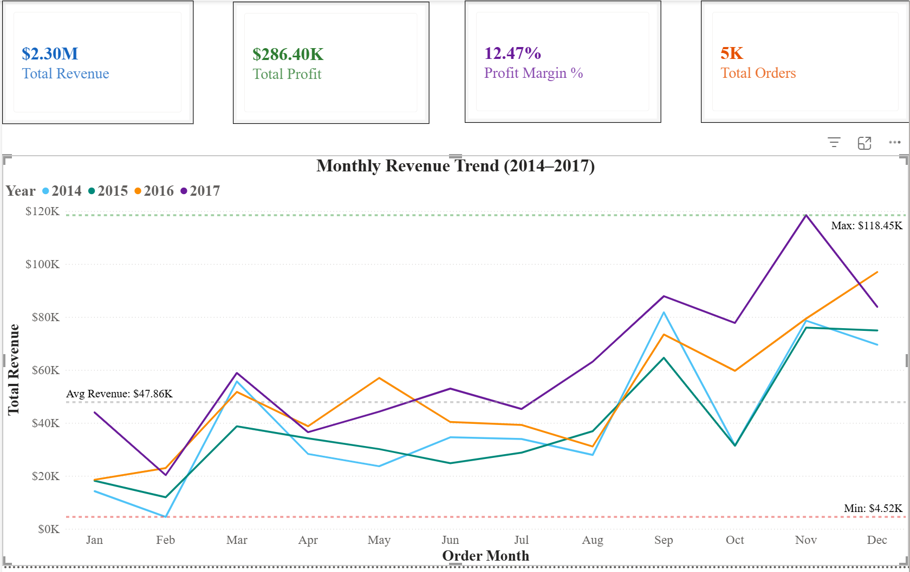
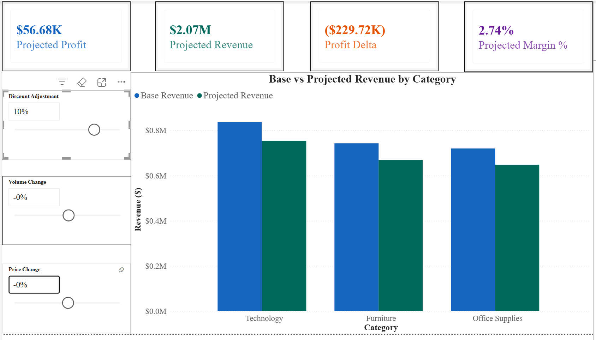

# RetailPulse: Sales & Revenue Analytics with What-If Scenario Simulator


## Overview

RetailPulse is an end-to-end business intelligence project that turns four years of raw retail transaction data into actionable insights through an interactive 5-page Power BI dashboard. It answers three business questions:

1. Which products, regions, and customer segments drive profit, and which lose money?
2. How has the business grown, and what is driving that growth?
3. What happens to revenue and margin if pricing, discounts, or sales volume change?

The third question is answered by a **What-If Scenario Simulator** built with DAX parameters, which lets a user model pricing, discount, and volume changes and see the projected impact on revenue, profit, and margin.

---

## Dashboard Preview




---

## Dashboard Pages

| Page | Description |
| --- | --- |
| 1 - Executive Summary | KPI cards (Revenue, Profit, Margin, Orders) + Monthly Revenue Trend (2014-2017) |
| 2 - Product Analysis | Top 10 Products by Revenue + Revenue by Category |
| 3 - Profitability Analysis | Profit by Sub-Category + Revenue vs Profit bubble chart |
| 4 - Customer & Regional | Revenue by Region and Segment with Year, Category, and Ship Mode slicers |
| 5 - What-If Simulator | Pricing, discount, and volume scenario modeling with DAX parameters |

---

## Key Business Insights

**Overall performance (2014-2017)**
- Total revenue of **$2.30M** and total profit of **$286K**, an overall margin of **12.47%**
- Revenue grew **51%** and profit grew **89%** from 2014 to 2017, so profit grew faster than revenue

**What is driving growth**
- Order count grew **74%** (969 to 1,687), but average order value fell **13%** ($500 to $435). Growth came from more orders, not larger ones
- In 2015, revenue dipped **2.8%** while profit rose **24%** and margin improved from 10.23% to 13.10%
- In 2017, revenue grew **20%** but margin slipped from 13.43% to 12.74%, so the latest growth came at some cost to profitability

**Products**
- **Furniture generates 32% of revenue but only 6% of profit** (2.49% margin vs ~17% for Technology and Office Supplies), dragged down by loss-making Tables and Bookcases
- **Technology** is the highest revenue category at **$836K**, 36.4% of total sales
- **Three sub-categories lose money:** Tables (-8.56% margin, a $17K loss on $200K+ revenue), Bookcases (-3.02%), and Supplies (-2.55%)
- **Supplies appears profitable at the order level**, since most orders make money, but loses money overall because a few large orders carry heavy losses
- **Copiers** deliver the highest profit of any sub-category at **$56K**

**Regions and seasonality**
- **South** is the weakest region across all customer segments
- **West and East Consumer** segments consistently exceed a $200K regional revenue benchmark
- **November 2017** was the peak month at **$118.45K**, driven by Q4 holiday demand

---

## Methodology Note: How Margin Is Calculated

Profit margin is calculated as **total profit divided by total revenue**, not as an average of row-level margins.

Averaging row margins gives a $10 order the same weight as a $1,000 order, which produced misleading results in this dataset:

| Sub-Category | Average of Row Margins | True Margin (Profit / Revenue) |
| --- | --- | --- |
| Supplies | +11.20% (looks profitable) | **-2.55% (loses money)** |
| Machines | -7.20% (looks unprofitable) | **+1.79% (profitable)** |
| Bookcases | -12.66% | -3.02% |
| Tables | -14.77% | -8.56% |

All SQL queries and Power BI measures use the revenue-weighted method. SQL results were reconciled against the Power BI measures to confirm both report the same values. The comparison query is included at the end of `scripts/retailpulse_queries.sql`.

---

## Data Pipeline

```
Raw CSV (9,994 rows x 21 columns)
      |
Python Cleaning (Pandas)
  - Date parsing and formatting
  - Feature engineering: time features, ship duration, revenue,
    cost, profit margin, discount flag, revenue bands
  - 21 -> 31 columns
      |
MySQL Database (retailpulse)
  - sales table with 31 columns
  - Loaded with LOAD DATA INFILE, row count verified after load
  - 5 analytical queries + 1 validation query
      |
Power BI Dashboard
  - Direct MySQL connection (Import mode)
  - DAX measures and What-If parameters
```

---

## DAX Measures

**Core KPIs**

```
Total Revenue = SUM('retailpulse sales'[revenue])
Total Profit = SUM('retailpulse sales'[profit])
Profit Margin % = DIVIDE(SUM('retailpulse sales'[profit]), SUM('retailpulse sales'[revenue]))
Total Orders = DISTINCTCOUNT('retailpulse sales'[order_id])
Avg Order Value = DIVIDE([Total Revenue], [Total Orders])
Base Cost = [Base Revenue] - [Total Profit]
```

**What-If Simulator**

Price and discount change what is charged per unit, so they affect revenue only. Volume changes how many units are sold, so it scales both revenue and cost.

```
Base Revenue = SUM('retailpulse sales'[revenue])
Base Cost = SUM('retailpulse sales'[cost])

Projected Revenue =
VAR PriceChange = 'Price Change'[Price Change Value]
VAR VolumeChange = 'Volume Change'[Volume Change Value]
VAR ExtraDiscount = 'Discount Adjustment'[Discount Adjustment Value]
RETURN
    [Base Revenue] * (1 + PriceChange) * (1 - ExtraDiscount) * (1 + VolumeChange)

Projected Cost =
VAR VolumeChange = 'Volume Change'[Volume Change Value]
RETURN
    [Base Cost] * (1 + VolumeChange)

Projected Profit = [Projected Revenue] - [Projected Cost]
Projected Margin % = DIVIDE([Projected Profit], [Projected Revenue])

Revenue Delta = [Projected Revenue] - [Base Revenue]
Profit Delta = [Projected Profit] - SUM('retailpulse sales'[profit])
Margin Delta = [Projected Margin %] - [Profit Margin %]
```

**Simulator validation checks**

| Slider Settings | Expected Result |
| --- | --- |
| All at 0 | Projected values equal actual values; all deltas are 0 |
| Volume +10% only | Revenue and cost both rise 10%; margin unchanged |
| Price +10% only | Revenue rises 10%; cost unchanged; margin rises |
| Discount +10% only | Revenue falls 10%; cost unchanged; margin falls |

---

## Tech Stack

| Layer | Tools |
| --- | --- |
| Data Cleaning & EDA | Python (Pandas, NumPy), Jupyter Notebook |
| Database | MySQL, MySQL Workbench |
| Visualization & BI | Power BI Desktop, DAX |
| Version Control | Git, GitHub |

---

## Project Structure

```
RetailPulse/
|
|-- data/
|   |-- Sample_-_Superstore.csv          # Raw dataset (Kaggle Superstore)
|   |-- superstore_cleaned.csv           # Cleaned and feature-engineered dataset
|
|-- scripts/
|   |-- retailpulse_cleaning.ipynb       # Python data cleaning notebook
|   |-- retailpulse_queries.sql          # Table setup, data load, 5 analytical queries, validation query
|
|-- dashboard/
|   |-- RetailPulse_Dashboard.pbix       # Power BI dashboard file
|   |-- RetailPulse_Dashboard.pdf        # PDF export of all 5 pages
|
|-- images/                              # Dashboard screenshots used in this README
|
|-- README.md
```

---

## Dataset

**Source:** [Kaggle - Superstore Sales Dataset](https://www.kaggle.com/datasets/vivek468/superstore-dataset-final)

- 9,994 order lines x 21 original columns
- Date range: January 2014 to December 2017
- Covers orders, customers, products, sales, discounts, and profit across US regions

---

## How to Run

**1. Clone the repository**

```
git clone https://github.com/jaira26/RetailPulse.git
cd RetailPulse
```

**2. Run the cleaning notebook**

```
jupyter notebook scripts/retailpulse_cleaning.ipynb
```

This produces `data/superstore_cleaned.csv`.

**3. Set up the MySQL database**

- In MySQL Workbench, run `SHOW VARIABLES LIKE 'secure_file_priv';` to find the folder MySQL is allowed to load files from
- Copy `superstore_cleaned.csv` into that folder
- Update the file path in the `LOAD DATA INFILE` statement if it differs from the default
- Run `scripts/retailpulse_queries.sql`

**4. Open the Power BI dashboard**

- Install MySQL Connector/NET if Power BI prompts for it
- Open `dashboard/RetailPulse_Dashboard.pbix` in Power BI Desktop
- Update the MySQL connection to your local server and credentials
- Click Refresh

---

## Limitations and Next Steps

- **Price elasticity:** the simulator treats price and volume as independent. In practice, raising prices usually reduces volume. A next version would add an elasticity assumption so a price increase automatically lowers projected volume.
- **Database design:** add a primary key and indexes aligned to the dashboard's filters (region, segment, category, year) to support larger datasets.
- **Portability:** the load step uses a hardcoded Windows file path. Writing the cleaned DataFrame directly to MySQL with `pandas.to_sql()` would remove that dependency.

---

## Author

**Jairaghavendra Sridhar**
MS Data Analytics Engineering, Northeastern University
[LinkedIn](https://linkedin.com/in/jairaghavendrasridhar26) | [GitHub](https://github.com/jaira26)
